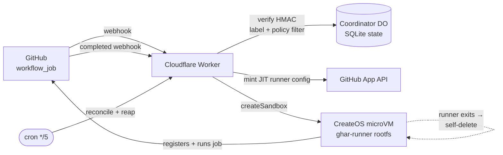

<div align="center">

# createos-sandbox-ghar

**Ephemeral GitHub Actions self-hosted runners on [CreateOS Sandbox](https://createos.sh) microVMs.**

One throwaway KVM microVM per job. Booted when a job is queued, destroyed seconds after it finishes.
The whole controller is a single Cloudflare Worker + one SQLite Durable Object — it fits in the free plan.

[](LICENSE)
[](https://github.com/NodeOps-app/createos-sandbox-ghar/actions/workflows/ci.yml)
[](https://workers.cloudflare.com/)
[](https://bun.sh)

</div>

---

## What you get

```yaml
jobs:
  build:
    runs-on: [createos]      # ← that's it
    steps:
      - run: echo "hello from a fresh microVM"
```

| | |
| --- | --- |
| **Clean machine every job** | Each job gets its own microVM from a pre-baked rootfs. No leftover state, no cross-job contamination, no runner cleanup steps. |
| **Real isolation for untrusted code** | KVM microVM boundary, not a shared container. Fork PRs, `npm install`, `docker build` — all confined to a VM that ceases to exist afterwards. |
| **Zero idle cost** | Nothing is running between jobs. No warm pool, no idle runner VMs, no autoscaler to babysit. |
| **Fast teardown** | The guest self-deletes its own VM the moment the runner exits — it doesn't wait for a webhook round trip. |
| **Free-plan control plane** | Cloudflare Workers Free + one SQLite Durable Object. No Kubernetes, no controller VM, no database to run. |
| **Self-healing** | A 5-minute cron reconciles against GitHub: re-drives jobs whose webhook was lost, reaps VMs whose runner never came online, deletes runner registrations orphaned by jobs that never ran. |

This repo is both a working autoscaler and a reference example of building on the CreateOS Sandbox SDK.

## How it works



1. A `workflow_job.queued` webhook arrives. The Worker verifies the HMAC signature, keeps only jobs labelled `runs-on: [createos]`, and applies the provisioning policy.
2. The **Coordinator** Durable Object records the job, enforces `MAX_CONCURRENT`, and queues the overflow.
3. The Worker mints a **JIT runner config** via the GitHub App, boots a sandbox from the `ghar-runner` template, and launches the runner detached. Ownership is recorded in the DO *before* launch, so a VM can never be leaked by a race.
4. The runner takes the job, runs it, and exits — **ephemeral**, so it deregisters itself.
5. Teardown happens in three layers (see [Teardown](#teardown)): the guest deletes its own VM in seconds, the `completed` webhook frees the concurrency slot and confirms the destroy, and a cron sweeps anything that fell through.

## Prerequisites

- **[bun](https://bun.sh)** ≥ 1.3 — this project is bun-only (no npm/node).
- A **Cloudflare account** — the Workers **Free** plan is enough.
- A **CreateOS Sandbox** account: control-plane URL + API key ([createos.sh](https://createos.sh)).
- **Admin on a GitHub org** — to create and install a GitHub App.

## Quickstart

### 1. Install

```bash
git clone https://github.com/NodeOps-app/createos-sandbox-ghar
cd createos-sandbox-ghar
bun install

bun run lint && bun run typecheck && bun run test    # all green?
```

### 2. Create the GitHub App

Org settings → Developer settings → GitHub Apps → **New GitHub App**:

- **Permissions**
  - Organization → **Self-hosted runners: Read & write** — to mint JIT runner configs.
  - Repository → **Actions: Read** — needed by the `fork-gated` policy, harmless otherwise.
- **Subscribe to events**: **Workflow job**.
- **Webhook URL**: `https://<your-worker>.workers.dev/webhook` (you get this in step 5 — set a placeholder now, fix it after).
- **Webhook secret**: a strong random string → becomes `GITHUB_WEBHOOK_SECRET`.

Install the App on your org, then note the **App ID** and the **Installation ID** (the number in the installation settings URL: `.../installations/<ID>` — *not* the App client id).

Generate a private key (App settings → **Generate a private key**). GitHub hands you a PKCS#1 `.pem`; Web Crypto needs PKCS#8:

```bash
openssl pkcs8 -topk8 -inform PEM -outform PEM -nocrypt -in app.pem -out app.pkcs8.pem
```

### 3. Build the runner template

Bakes a rootfs named `ghar-runner`: the Actions runner, Docker (docker-ce with the buildx
and compose plugins, so `docker/build-push-action`, `docker compose` and `services:` all
work), and the slice of `ubuntu-latest` that workflows assume is always there — `gh`, a C
toolchain (`gcc`/`g++`/`make`, for cgo, `go test -race` and node-gyp), `python3`, `zstd`
(the codec `actions/cache` reaches for), and the usual archivers (`wget zip bzip2 xz
unzip file`). The microVM has no init system, so `start-runner.sh` starts `dockerd` itself
and waits for the socket before the runner accepts a job.

**Language runtimes are deliberately not baked in.** Go, Node, Bun and Python arrive at job
time via `actions/setup-*` and `asdf-vm/actions/install`, because every repo pins its own
version — baking one in means rebuilding this template on every bump and still missing what
the repo asked for. The image instead ships what those installers need to work, including
two fixups `start-runner.sh` applies at boot: `/dev/fd` + `/dev/shm` (absent from the
microVM's devtmpfs, and without them bash process substitution and shared memory both fail),
and a tool cache pinned to `/opt/hostedtoolcache`. It also makes the box report itself as
Ubuntu 22.04, because `actions/setup-python` refuses to run on Debian — see the gotchas in
`AGENTS.md` before you touch any of that.

```bash
CREATEOS_BASE_URL=https://api.sb.createos.sh \
CREATEOS_API_KEY=<key> \
bun run build:template
```

The build always pulls the **latest `actions/runner`** release (GitHub refuses jobs from deprecated runners), removes any existing `ghar-runner` template, and rebuilds. Wait for `ready: <id>`. See [Keeping the runner current](#keeping-the-runner-current) for the daily auto-bump.

### 4. Configure

Non-secret config lives in `wrangler.toml [vars]` — **set `GITHUB_ORG` to your org** and adjust the size/policy knobs ([reference below](#configuration)).

Secrets never go in `wrangler.toml`:

```bash
bunx wrangler secret put GITHUB_APP_ID           # App ID number
bunx wrangler secret put GITHUB_INSTALLATION_ID  # Installation ID number
bunx wrangler secret put GITHUB_APP_PRIVATE_KEY  # full contents of app.pkcs8.pem
bunx wrangler secret put GITHUB_WEBHOOK_SECRET   # secret from step 2
bunx wrangler secret put CREATEOS_API_KEY        # CreateOS control-plane key
```

For local `wrangler dev`, copy `.dev.vars.example` → `.dev.vars` and fill the same values (gitignored).

### 5. Deploy

The repo is connected to **Cloudflare Workers Builds**, so **a push to `main` deploys it**. No
CLI step, no deploy workflow in `.github/workflows/` — Cloudflare builds from the connected
repo. Watch the build in the Cloudflare dashboard (Workers → this Worker → Deployments).

`bun run deploy` (`bunx wrangler@latest deploy`) still works and is the escape hatch for a
hotfix when you cannot push, but it deploys your **working tree**, not `main` — so it can
quietly ship uncommitted local changes, and a push landing behind it will overwrite whatever
it shipped. Prefer the push.

Point the GitHub App's webhook URL at the deployed Worker (`https://<worker>.workers.dev/webhook`).

### 6. Verify

```bash
curl https://<worker>.workers.dev/health     # → ok
```

Then add a `runs-on: [createos]` job to a repo in the org and watch a microVM boot, run it, and disappear. This repo ships one: **Actions → ghar-test → Run workflow**.

## Configuration

Set in `wrangler.toml [vars]` unless marked secret (`wrangler secret put`).

| Var | Secret | Default | Meaning |
| --- | :---: | --- | --- |
| `GITHUB_ORG` | | — | Org served (case-insensitive). **Change this.** |
| `GITHUB_API_URL` | | `https://api.github.com` | Override for GitHub Enterprise. |
| `GITHUB_APP_ID` | ✅ | — | App identity. |
| `GITHUB_INSTALLATION_ID` | ✅ | — | Org installation id — **numeric**, not the App client id. |
| `GITHUB_APP_PRIVATE_KEY` | ✅ | — | **PKCS#8** PEM (convert from GitHub's PKCS#1). |
| `GITHUB_WEBHOOK_SECRET` | ✅ | — | Webhook HMAC secret. |
| `CREATEOS_BASE_URL` | | — | CreateOS control plane, e.g. `https://api.sb.createos.sh`. |
| `CREATEOS_API_KEY` | ✅ | — | CreateOS API key. |
| `RUNNER_LABEL` | | `createos` | The opt-in `runs-on` label. Also the prefix for shaped labels (`createos-8vcpu-16gb`) — see [Choosing a runner size](#choosing-a-runner-size). |
| `RUNNER_TEMPLATE` | | `ghar-runner` | Rootfs template built in step 3. |
| `SANDBOX_NAME_PREFIX` | | — | Cosmetic VM name prefix (`<prefix>-<jobId>`). |
| `RUNNER_SHAPE` | | `s-4vcpu-4gb` | VM size for the bare `RUNNER_LABEL`. |
| `MIN_RUNNER_MEM_MIB` | | `2048` | Floor on shapes offered as shaped labels — smaller shapes can't run an Actions runner. |
| `RUNNER_DISK_MIB` | | `30720` | Overlay disk — **must be ≤ your plan's disk cap** or `createSandbox` 403s. |
| `MAX_CONCURRENT` | | `0` | `0` = unlimited; `N` = cap + pending queue. Set a finite value in production. |
| `PROVISION_POLICY` | | `org-wide` | `org-wide` \| `repo-allowlist` \| `fork-gated`. A **cost** control (which repos get a VM), not a GitHub-side execution boundary — see `RUNNER_GROUP_ID`. |
| `REPO_ALLOWLIST` | | — | CSV of `owner/repo`, used when policy is `repo-allowlist`. |
| `RUNNER_GROUP_ID` | | `1` | GitHub runner group the JIT runner joins. `1` = org-wide Default. Which repos may schedule onto the runner is that group's GitHub policy — point this at a group scoped to your repos to make the allowlist an actual execution boundary. |
| `REAPER_MAX_AGE_MS` | | `3600000` | Orphan-VM cutoff — keep **above your longest job**. |
| `RECONCILE_GRACE_MS` | | `180000` | Boot grace before a runner-less VM is reaped — keep **above VM boot + runner registration**. |
| `RECOVERY_SUBREQUEST_BUDGET` | | `30` | Max GitHub subrequests the 5-min recovery scan spends before deferring the tail repos to the next tick (cursor-resumed). Caps the O(installed-repos) fan-out under the Free-plan 50-subrequest cap. Raise once installed repos routinely exceed ~half this. |
| `ALERT_WEBHOOK_URL` | ✅ | — | Optional Slack-compatible webhook for provision/teardown failures. |
| `ADMIN_TOKEN` | ✅ | — | Bearer token for the `/admin/*` tenant-registry API. Unset = the whole surface 404s (see [Tenant registry](#tenant-registry-admin-api)). |
| `TENANCY_MODE` | | `multi` | `single` \| `multi`. Multi-tenancy master switch. This repo ships `multi` because NodeOps prod seeds its Tenant first. **A fresh self-host: leave/set `single` here, deploy, then seed+approve your first Tenant and switch to `multi`** — `multi` admission fails closed (refuses every job) until a Tenant is seeded+approved. See [Tenant registry](#tenant-registry-admin-api). |
| `COMMUNITY_VM_BANDWIDTH_BYTES` | | `107374182400` (100 GB) | Per-VM egress quota for community tenants. Unused while `TENANCY_MODE=single`. |
| `APPLY_FORM_URL` | | — | Link surfaced in refusal notices for orgs that want to apply for access. Unused while `TENANCY_MODE=single`. |

## Choosing a runner size

```yaml
jobs:
  build:
    runs-on: [createos]             # RUNNER_SHAPE (default s-4vcpu-4gb)
  big:
    runs-on: [createos-8vcpu-16gb]  # a specific CreateOS shape
```

Available labels are derived live from the CreateOS shape catalog (`GET /v1/shapes`), so a shape added to the platform is usable without redeploying this Worker. Shapes below `MIN_RUNNER_MEM_MIB` (default 2048) or with a fractional-vCPU quota are excluded — an Actions runner cannot work on them.

Use exactly one `createos*` label. Two (`[createos, createos-2vcpu-2gb]`) is refused and the job will never get a runner.

## Teardown

Three layers, each a backstop for the one before:

0. **In-guest self-delete (fast path).** When the runner exits, the baked-in `start-runner.sh` POSTs to the guest agent's loopback-only endpoint (`127.0.0.1:1029/self/delete`) and the host destroys the VM by its identity — within seconds, independent of webhook latency. Best-effort: if the host predates self-signal, layers 1–2 still clean up. Reclaims the **VM only**; the concurrency slot is freed by layer 1.
1. **`completed` webhook (authoritative).** GitHub sends `workflow_job.completed` with `runner_name`. The Worker frees the concurrency slot and destroys the VM whose runner *actually ran the job* — keyed on runner identity, not the provisioning job, so a backlog can't tear down the wrong VM. A destroy that hits `NotFound` (layer 0 got there first) counts as success. The row stays in `destroying` until the destroy is confirmed, so a failed destroy is never lost.
2. **Reaper cron (safety net).** Every 5 minutes: re-destroy any unconfirmed `destroying` VM, and sweep `running` VMs older than `REAPER_MAX_AGE_MS` whose completion was never recorded (dropped webhook). Age-only — hence the "keep it above your longest job" rule.

> **Why runner identity?** An ephemeral runner takes the *first* matching queued job, which may not be the job that provisioned its VM when there's a backlog. Teardown therefore keys on the `runner_name` in the `completed` payload.

## Reconciler

Webhooks are edge-triggered: GitHub sends `queued` **exactly once**. If that delivery is lost, or provisioning throws, the job sits queued with no runner until GitHub's 24-hour timeout. Symmetrically, a VM whose runner never registers (bad JIT config, guest crash) looks healthy to the controller.

The same 5-minute cron runs a **reconciler** before the reaper, treating GitHub as the source of truth:

1. **Runner-liveness reap** — lists the org's `online` runners; any tracked VM older than `RECONCILE_GRACE_MS` whose runner isn't online is destroyed. Keys on live runner identity, so long-running jobs are spared. Fails safe: an API error skips the step.
2. **Queued-job re-drive** — lists every still-`queued` labelled job across installed repos and replays it through the normal provisioning path, reusing the same cap and dedup logic. Jobs already being provisioned are ignored.
3. **Orphaned-runner sweep** — deletes the GitHub runner registrations left behind by jobs that never completed one. GitHub auto-removes an ephemeral runner only *after* it finishes a job, so every attempt that dies after the JIT mint (createSandbox failed, job cancelled mid-boot, VM reaped before pickup) leaves a registration listed `offline` forever. A registration is deleted only if its name parses as ours (`cos-<jobId>-<xx>`), GitHub reports it offline and not busy, **and** the coordinator holds no row for that job id — so a runner that is merely booting (offline for the ~30s its VM takes to come up) is never touched, and runners this controller didn't mint are out of scope entirely. Capped at 10 deletes per tick to stay inside the Free-plan subrequest budget; the rest follow next tick.

## Keeping the runner current

GitHub deprecates old runner versions and **refuses their jobs**, so the baked runner must stay fresh:

- `bun run build:template` always builds the latest `actions/runner` release.
- `.github/workflows/bump-runner.yml` runs **daily**: if a newer runner shipped, it rebuilds the `ghar-runner` template via the CreateOS CLI and commits the bump. Needs the repo secret **`CREATEOS_API_KEY`**.

## Alerting

Failures are logged (`wrangler tail`). For pushed alerts, set the optional `ALERT_WEBHOOK_URL` secret to a Slack-compatible incoming webhook — the Worker posts on provision and teardown failures. Unset = no-op.

## Tenant registry (admin API)

The Worker keeps a registry of Tenants (approved GitHub orgs) and Projects (approved repos
inside them) — see [CONTEXT.md](CONTEXT.md) for the Tenant/Project/Grant vocabulary.
**Approval is manual by design**: an applicant is vetted by a human, then an operator records
the decision through these routes. Approving a tenant that isn't `allow_all_repos` now creates
a GitHub runner group scoped to its approved projects, and fails closed: a tenant reaches
`approved` only once that group exists (`400` if it has no approved projects yet, `502` on a
GitHub failure), so its runners can never land in the org-wide Default group. When
`TENANCY_MODE=multi` ([Configuration](#configuration)), the webhook path enforces this
registry — tenant/project approval, shape ceiling, monthly grant — on every queued job; in
`single` mode (today's default) the registry only stores state and the webhook path ignores it.

Set the `ADMIN_TOKEN` secret to enable the API:

```bash
bunx wrangler secret put ADMIN_TOKEN   # e.g. output of `openssl rand -hex 32`
```

Every request needs `Authorization: Bearer <ADMIN_TOKEN>`. A missing token and a wrong token
both return **404** — indistinguishable from a route that doesn't exist — so an unconfigured
or misconfigured deployment exposes no probeable surface. This is intentional, not a bug to
fix into a `401`.

Six routes, all under `/admin`:

```bash
# List all tenants
curl https://<worker>.workers.dev/admin/tenants \
  -H "Authorization: Bearer $ADMIN_TOKEN"

# Create or fully replace a tenant — every field is required, nullable fields need an
# explicit `null`; this is a full-record upsert, not a patch, so omitting a field is a 400
# (an earlier version let a partial POST silently wipe fields like runner_group_id)
curl -X POST https://<worker>.workers.dev/admin/tenants \
  -H "Authorization: Bearer $ADMIN_TOKEN" -H "content-type: application/json" \
  -d '{
    "installation_id": 12345678, "org_login": "acme-org", "status": "approved",
    "allow_all_repos": true, "minute_grant": 10000, "concurrency_cap": 5,
    "max_shape": "s-4vcpu-8gb", "job_ttl_ms": 3600000,
    "runner_group_id": null, "contact": null, "notes": null, "approved_by": "pratik"
  }'

# Change status only (suspend/revoke/re-approve); 404 if the tenant doesn't exist
curl -X POST https://<worker>.workers.dev/admin/tenants/status \
  -H "Authorization: Bearer $ADMIN_TOKEN" -H "content-type: application/json" \
  -d '{"installation_id": 12345678, "status": "suspended"}'

# Approve one or more repos under a tenant; 404 if the tenant doesn't exist
curl -X POST https://<worker>.workers.dev/admin/projects \
  -H "Authorization: Bearer $ADMIN_TOKEN" -H "content-type: application/json" \
  -d '{"installation_id": 12345678, "projects": [{"repo_full_name": "acme-org/widgets", "repo_id": 987654321}]}'

# Revoke a repo; 404 if the tenant doesn't exist, also 404 if that repo was never approved
curl -X DELETE https://<worker>.workers.dev/admin/projects \
  -H "Authorization: Bearer $ADMIN_TOKEN" -H "content-type: application/json" \
  -d '{"installation_id": 12345678, "repo_full_name": "acme-org/widgets"}'

# Claim pre-registry job rows (tenant_id IS NULL) for a tenant, one-time at cutover;
# 404 if the tenant doesn't exist
curl -X POST https://<worker>.workers.dev/admin/backfill \
  -H "Authorization: Bearer $ADMIN_TOKEN" -H "content-type: application/json" \
  -d '{"installation_id": 12345678}'
```

## Onboarding a community tenant

`TENANCY_MODE=multi`, one public App (`createos-runners`), install-gated admission
(ADR [0006](docs/adr/0006-one-app-public-install-gated.md)). An org **installs**
the App freely, but only registry-**approved** Tenants get runners; unapproved
installs get one neutral check run pointing at `APPLY_FORM_URL`.

1. **Application** arrives via the apply link (fields per
   [`docs/community/onboarding-form.md`](docs/community/onboarding-form.md)).
2. **Review** and size the Tenant: `minute_grant`, `concurrency_cap`,
   `max_shape`, `job_ttl_ms`.
3. They **install the public App** on their org, selecting the repos. Their
   installation id is the trailing number in the install's settings URL, or via
   `GET /orgs/<org>/installation` (`.id`).
4. **Create the Tenant** `status: "pending"` (`POST /admin/tenants`, their
   installation id) **+ approve their repos** (`POST /admin/projects`; repo ids
   from `GET /repos/<owner>/<repo>` → `.id`).
5. **Approve**: `POST /admin/tenants` with `status: "approved"` — the runner
   group is auto-created scoped to their repos (fail-closed: a 502 means fix
   GitHub-side and retry; the Tenant stays unapproved).
6. Tell them: swap `runs-on: ubuntu-latest` → `runs-on: createos` (or a shaped
   label within their ceiling).

NodeOps is Tenant #1 with `allow_all_repos: true` — the only Tenant with that
flag; it skips runner-group creation and uses the org-wide Default group.

## Security notes

- **`PROVISION_POLICY=org-wide` serves every repo in the org, including fork PRs.** Safety then rests on VM isolation + ephemerality (each job gets a throwaway KVM VM; GitHub withholds secrets from fork PRs unless approved) and on `MAX_CONCURRENT` to bound the blast radius — **set it to a finite value in production**. For tighter control use `repo-allowlist`, or `fork-gated` (checks the run's head repo via the API).
- **`PROVISION_POLICY`/`REPO_ALLOWLIST` gate what we spend a VM on, not what GitHub will schedule onto our runners.** The JIT runners register into `RUNNER_GROUP_ID` (default `1` = the org-wide Default group); which repos may schedule onto a runner is that **group's** GitHub policy (`selected`/`all` repos), not our allowlist. So the allowlist is a cost control, not an execution boundary. To make it one, create a runner group whose GitHub policy is scoped to the allowlisted repos and set `RUNNER_GROUP_ID` to it.
- The webhook is authenticated with `X-Hub-Signature-256` HMAC; unsigned or invalid requests get `401`.
- Secrets belong in `wrangler secret`, never in `wrangler.toml`. `.dev.vars` and `.env*` are gitignored.
- Found a vulnerability? See [SECURITY.md](SECURITY.md).

## Development

```bash
bun run test        # vitest — unit + real-Durable-Object integration
bun run typecheck   # tsc --noEmit
bun run lint        # oxlint
bun run dev         # wrangler dev (needs .dev.vars)
```

Architecture, file-by-file responsibilities, conventions, and the toolchain gotchas that will bite you live in **[AGENTS.md](AGENTS.md)**. Domain vocabulary is in [CONTEXT.md](CONTEXT.md).

### Working with an AI agent

The repo is agent-ready. `AGENTS.md` is the single contributor guide, and `CLAUDE.md` symlinks to it, so **Claude Code, Codex, Cursor, and friends all pick up the same instructions with no setup**:

```bash
claude    # or: codex
> read AGENTS.md, then add <your change>
```

It carries the repo map, the verification commands an agent must run before claiming done, and the non-obvious constraints (pinned test toolchain, the Workers `fetch`-binding trap, the free-plan Durable Object rules) that an agent would otherwise rediscover the hard way.

## License

[MIT](LICENSE) © NodeOps

Built on [CreateOS Sandbox](https://createos.sh) · [SDK](https://github.com/NodeOps-app/createos-sandbox-sdk) · [CLI](https://github.com/NodeOps-app/createos-cli)
